<!-- SEÇÃO 1 -->

  

    1
    <h2 class="editable-text">Acesso e Ambiente</h2>
  

  

### 1.1. Página Inicial do Portal
O acesso à ferramenta inicia-se pelo portal corporativo da PSA Consultores. A interface principal apresenta as informações institucionais e o ponto de entrada para os sistemas internos.

  

    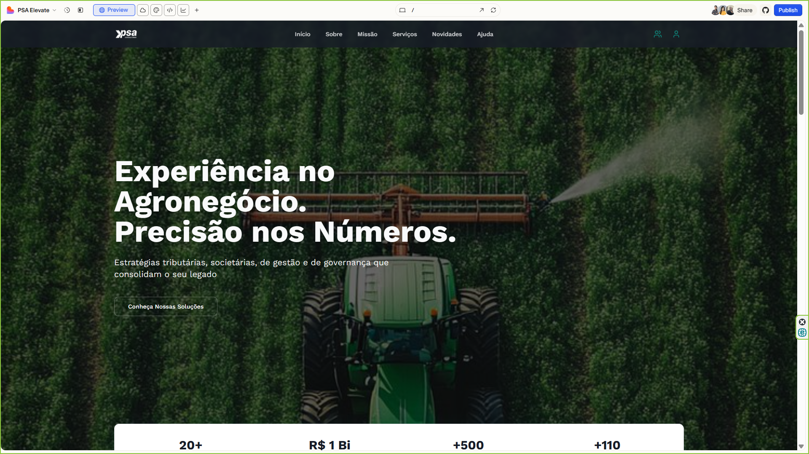
  

  
Visão geral do portal corporativo

### 1.2 Menu de Acesso à Equipe
No canto superior direito da tela, encontra-se o menu de usuário. Para acessar as ferramentas restritas, deve-se utilizar a opção destinada aos colaboradores ("Equipe").

  

    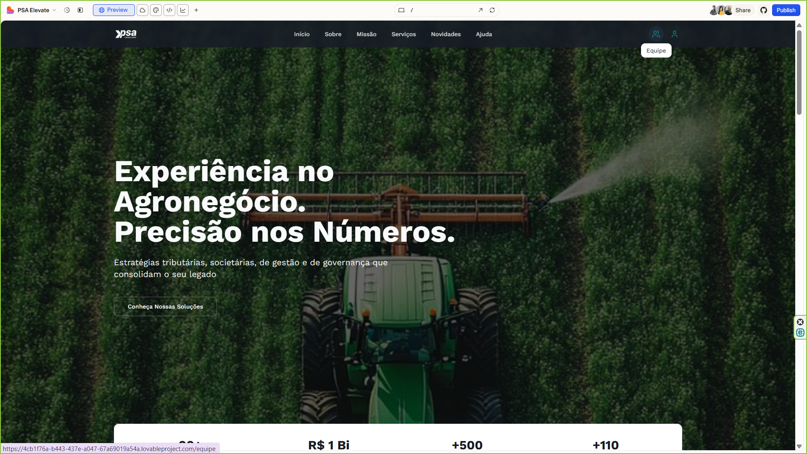
  

  
Localização do menu de acesso restrito

### 1.3 Seleção de Departamento
Antes do login, o sistema solicita a identificação da área de atuação. Esta etapa direciona o usuário para o conjunto de ferramentas adequado ao seu perfil.

  

    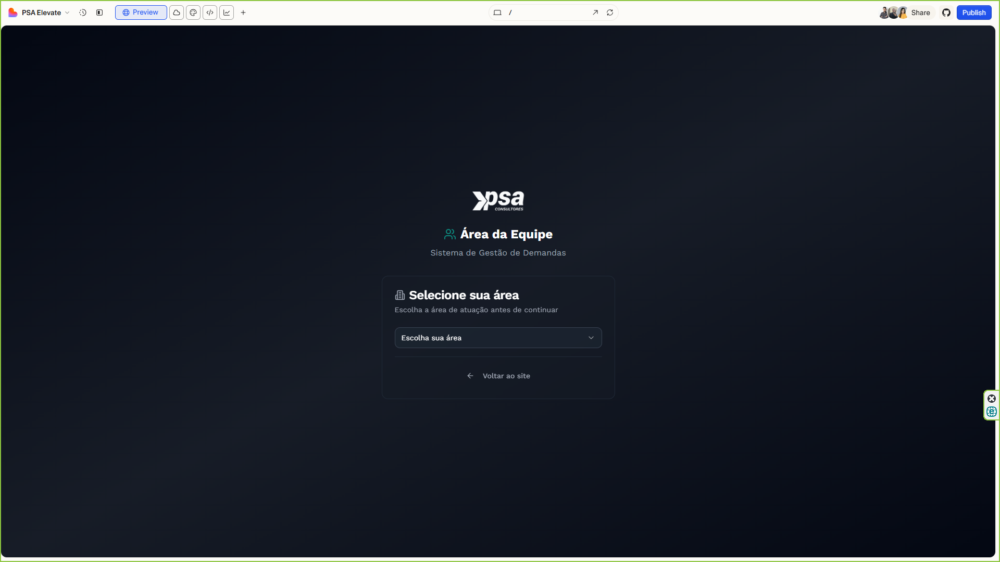
  

  
Tela de pré-seleção de departamento

### 1.4 Identificação da Área Digital
Na lista de opções disponíveis, a área "Digital" deve ser selecionada para garantir acesso aos módulos de desenvolvimento e auditoria fiscal.

  

    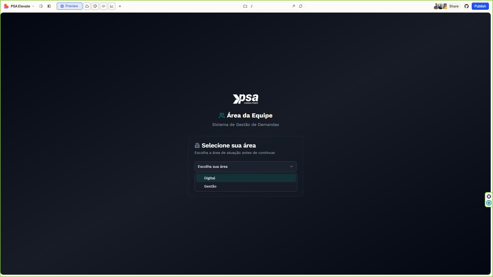
  

  
Seleção da área de competência

### 1.5 Tela de Autenticação
O formulário de login é exibido de acordo com a área selecionada, garantindo a segurança e o controle de acesso aos dados sensíveis da empresa.

  

    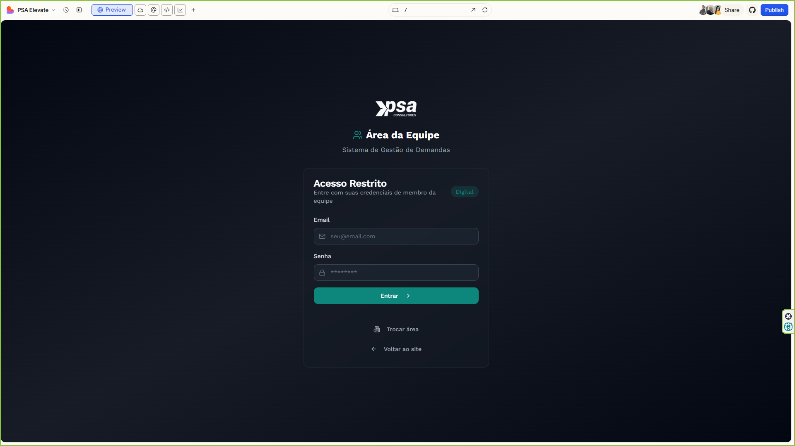
  

  
Interface de autenticação de usuário

### 1.6 Credenciais de Acesso
O usuário deve fornecer seu e-mail corporativo e senha pessoal. O sistema valida as credenciais para liberar o acesso ao ambiente de trabalho.

  

    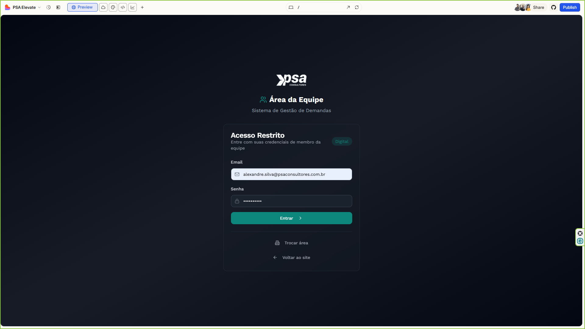
  

  
Preenchimento dos dados de acesso

### 1.7 Seleção de Ambiente de Trabalho
Após a autenticação, são apresentados os ambientes disponíveis. O ambiente "Digital Dev" concentra as ferramentas de criação, auditoria e manutenção de dados fiscais.

  

    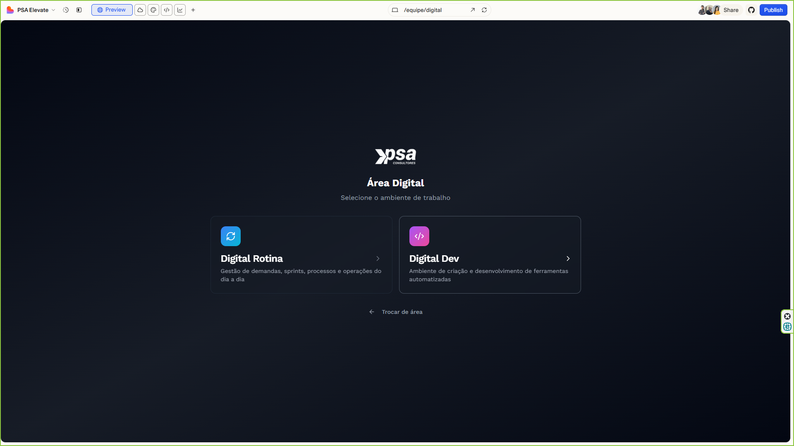
  

  
Escolha do ambiente operacional

### 1.8 Dashboard Principal
O painel inicial (Dashboard) oferece uma visão panorâmica das ferramentas ativas e permite a navegação rápida para os diferentes módulos do sistema.

  

    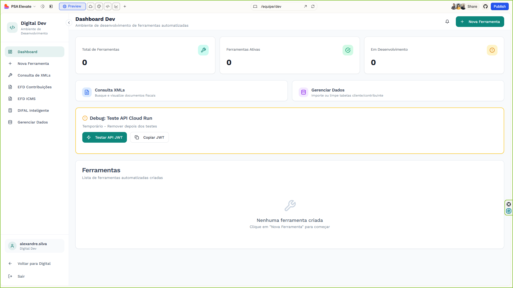
  

  
Visão geral das ferramentas disponíveis

  

<!-- SEÇÃO 2 -->

  

    2
    <h2 class="editable-text">Configuração da Auditoria</h2>
  

  

### 2.1. Acesso ao Módulo DIFAL
No menu lateral esquerdo, o módulo "DIFAL Inteligente" está disponível para acesso direto, centralizando todas as operações de auditoria de diferencial de alíquota.

  

    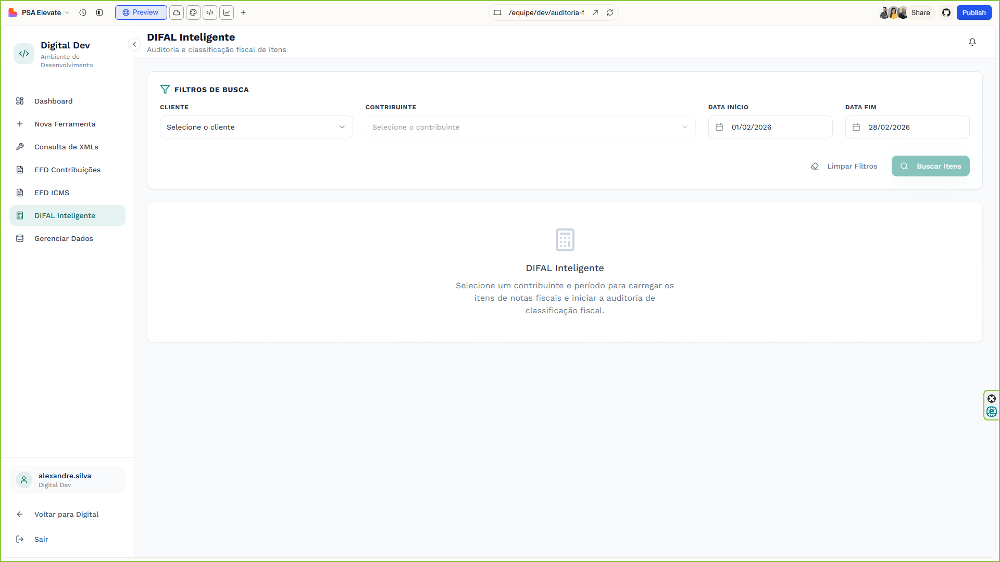
  

  
Navegação para o módulo de auditoria

### 2.2. Filtro de Cliente
O primeiro passo da configuração é definir a empresa auditada. O seletor de clientes lista todas as organizações vinculadas ao perfil do usuário logado.

  

    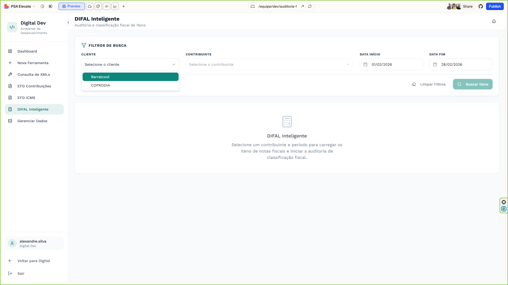
  

  
Definição da empresa cliente

### 2.3. Listagem de Contribuintes
Ao selecionar um cliente, o sistema carrega automaticamente a lista de contribuintes (filiais ou unidades de negócio) associadas, facilitando a localização da unidade correta.

  

    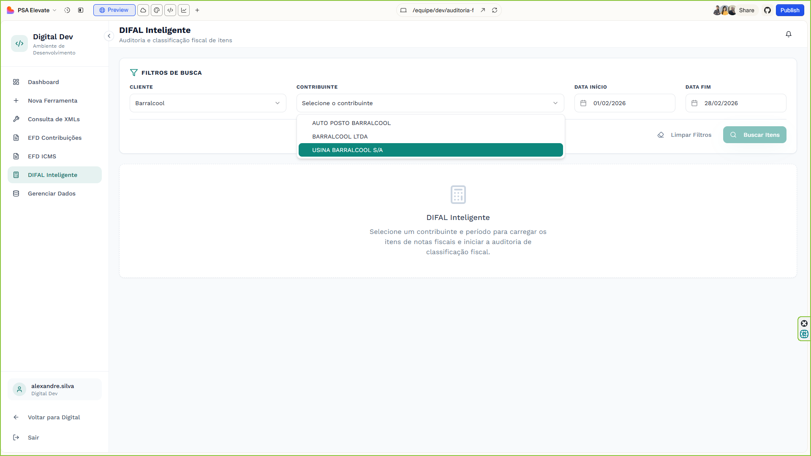
  

  
Visualização das unidades disponíveis

### 2.4. Seleção da Unidade Fiscal
A escolha precisa da unidade (Contribuinte) é fundamental para carregar as notas fiscais e regras tributárias específicas daquele CNPJ e UF.

  

    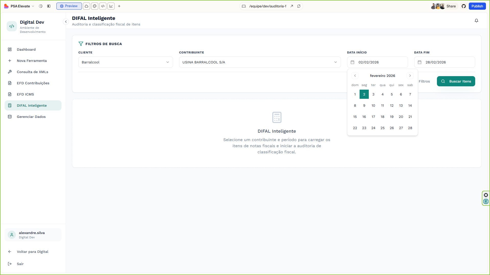
  

  
Definição do escopo da auditoria

### 2.5. Definição de Início do Período
O campo de data inicial delimita o começo da competência a ser auditada, permitindo recortes precisos de tempo para análise.

  

    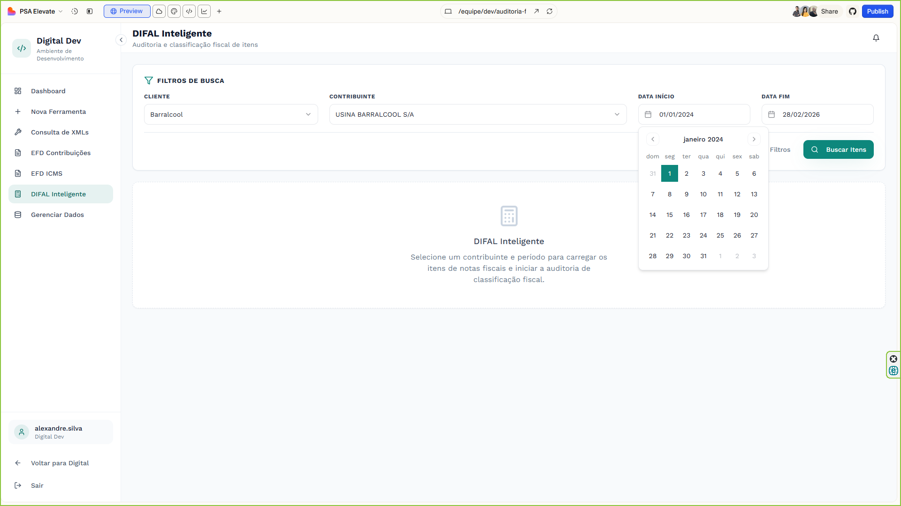
  

  
Configuração da data inicial

### 2.6. Definição de Fim do Período
O campo de data final encerra o intervalo de busca. O sistema buscará todas as notas fiscais emitidas ou recebidas dentro deste intervalo fechado.

  

    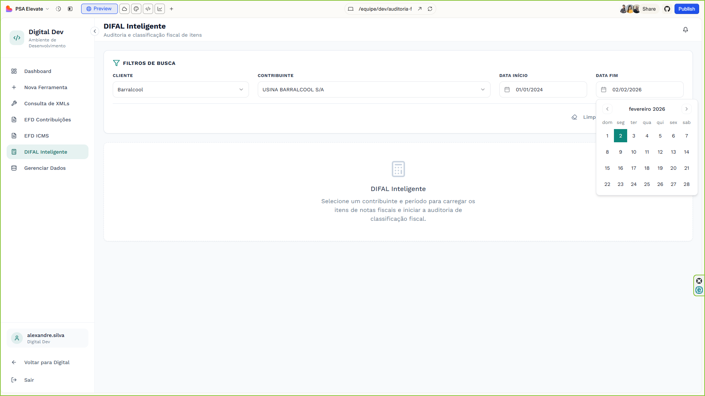
  

  
Configuração da data final

### 2.7. Execução da Busca
Com todos os parâmetros definidos, o botão "Buscar Itens" aciona o processamento e carregamento dos dados fiscais para a tela de trabalho.

  

    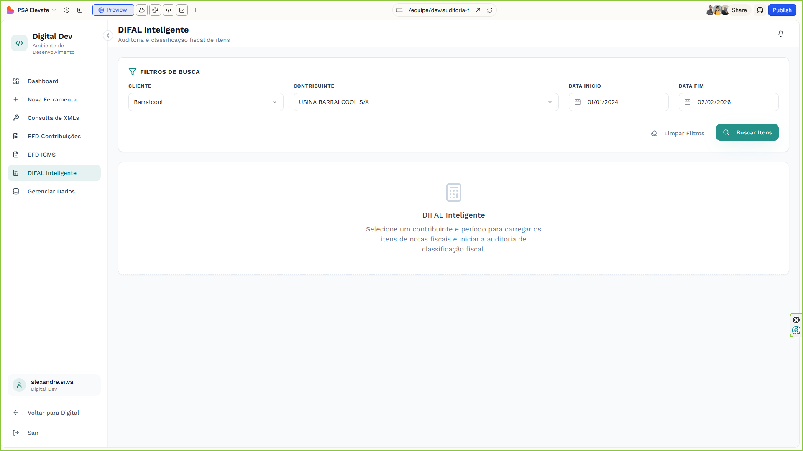
  

  
Carregamento dos dados solicitados

  

<!-- SEÇÃO 3 -->

  

    3
    <h2 class="editable-text">Análise e Classificação</h2>
  

  

### 3.1. Painel de Métricas
Logo após a busca, cards informativos no topo da tela apresentam um resumo quantitativo: total de itens pendentes versus itens já validados.

  

    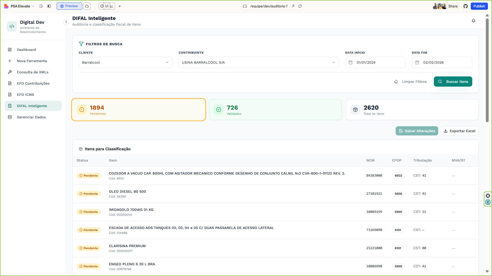
  

  
Indicadores de progresso da auditoria

### 3.2. Grade de Itens
A lista principal exibe os produtos retornados pela busca. Cada linha representa um item de nota fiscal, exibindo informações essenciais como Código, Descrição e Status atual.

  

    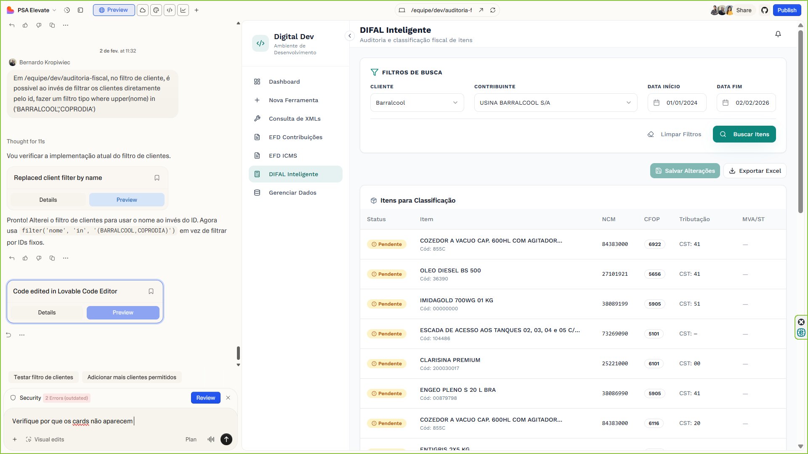
  

  
Visualização geral dos itens listados

### 3.3. Identificação de Pendências
Itens que ainda não foram auditados ou que requerem revisão são marcados com a etiqueta "Pendente" (cor amarela), destacando-os visualmente para ação do usuário.

  

    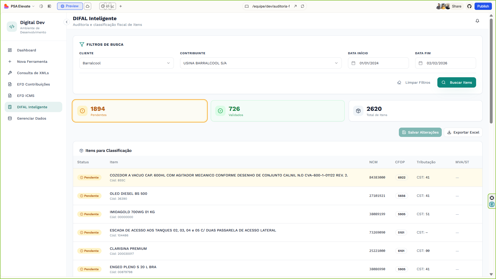
  

  
Destaque para itens aguardando análise

### 3.4. Modal de Detalhes do Produto
Ao clicar em um item, abre-se uma janela modal com informações detalhadas, incluindo NCM, CFOP, Valor Total e a descrição completa do produto conforme a nota fiscal.

  

    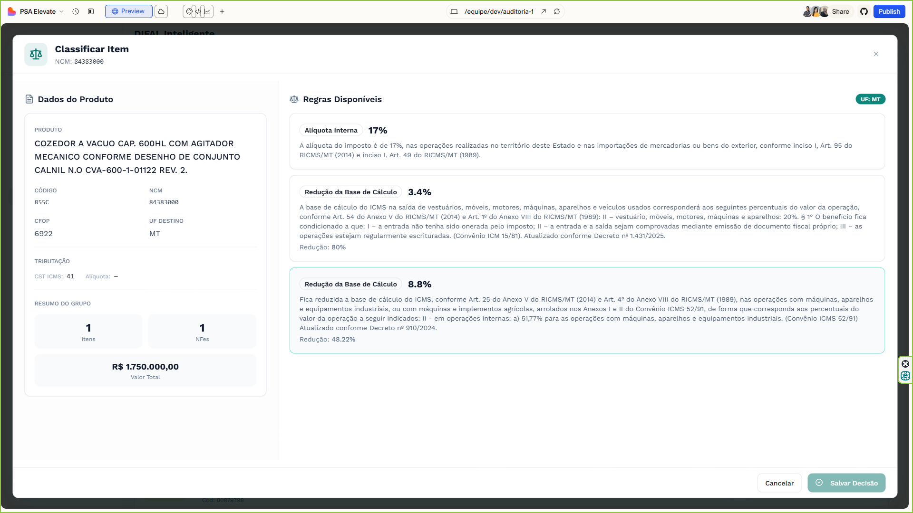
  

  
Interface de análise detalhada

### 3.5. Seleção de Regra Tributária
No painel direito do modal, o sistema sugere as regras fiscais aplicáveis. O usuário deve selecionar o card correspondente à tributação correta (ex: Alíquota, Isenção, Redução de Base).

  

    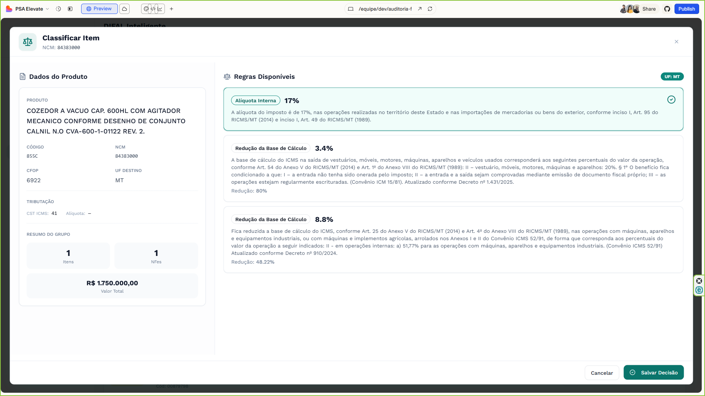
  

  
Aplicação da regra fiscal ao item

### 3.6. Confirmação da Decisão
Após escolher a regra, o botão "Salvar Decisão" confirma a classificação e aplica a tributação selecionada ao item, fechando o modal automaticamente.

  

    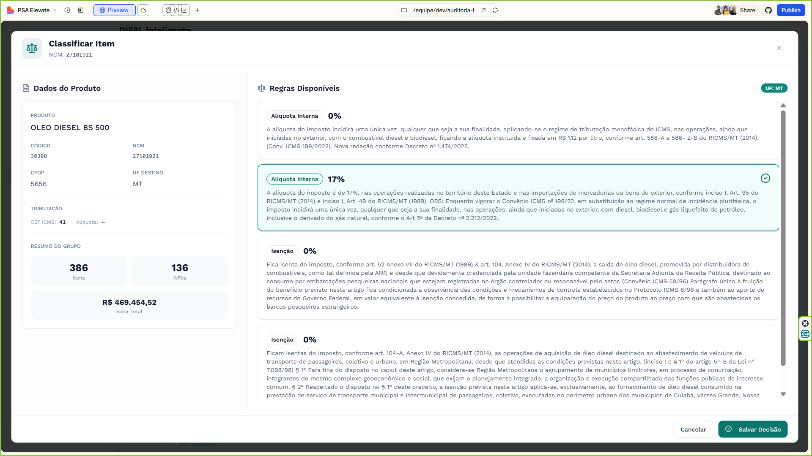
  

  
Efetivação da classificação individual

  

<!-- SEÇÃO 4 -->

  

    4
    <h2 class="editable-text">Conferência e Exemplos Práticos</h2>
  

  

### 4.1. Atualização de Status
Imediatamente após a classificação, o status do item na lista é atualizado para "Validado" (cor verde), indicando que a análise para aquele produto foi concluída localmente.

  

    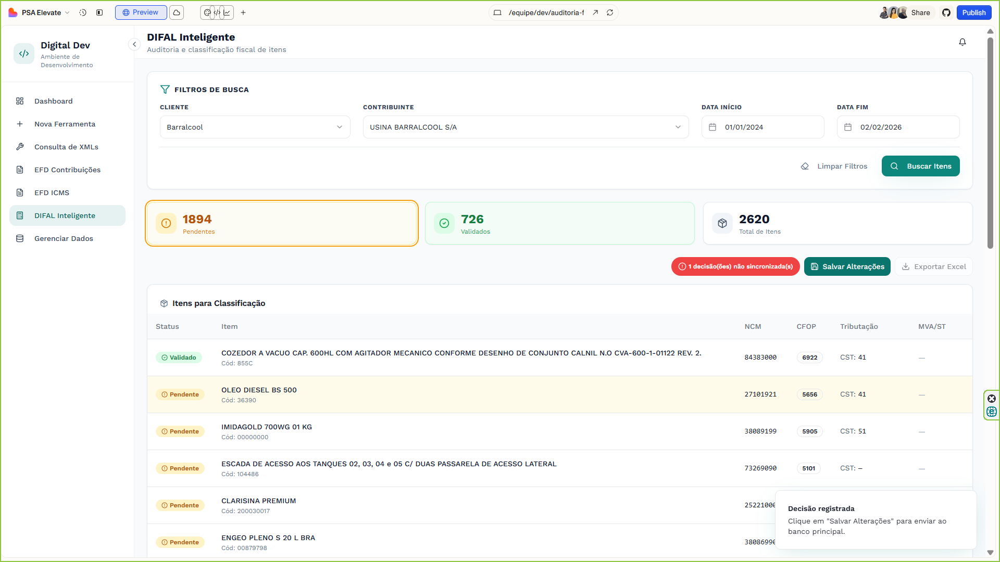
  

  
Feedback visual de conclusão

### 4.2. Acompanhamento na Lista Geral
A grade de itens reflete o progresso do trabalho em tempo real, permitindo ao auditor visualizar rapidamente quais itens já foram tratados e quais restam.

  

    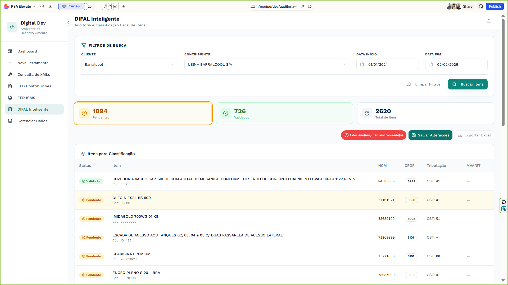
  

  
Monitoramento do fluxo de trabalho

### 4.3. Exemplo: Item Pendente
Visualização detalhada de um item específico (ex: Cana de Açúcar) no estado inicial, aguardando a intervenção do auditor.

  

    
  

  
Estado inicial do registro

### 4.4. Exemplo: Item Validado
O mesmo item após a aplicação das regras, demonstrando a alteração visual e de dados (CST, Alíquota) na linha correspondente.

  

    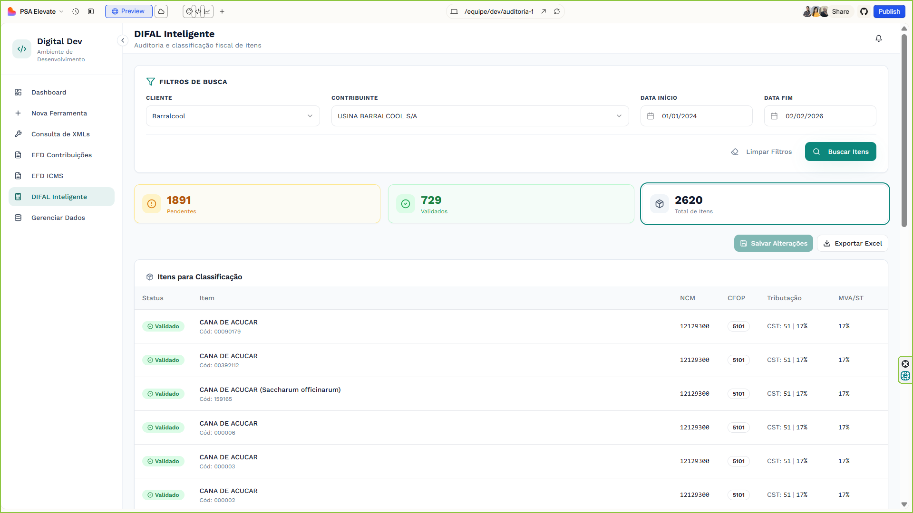
  

  
Estado final do registro auditado

### 4.5. Consolidação da Lista
Conforme o trabalho avança, a lista se transforma, exibindo majoritariamente itens validados, facilitando a identificação visual do que falta ser feito.

  

    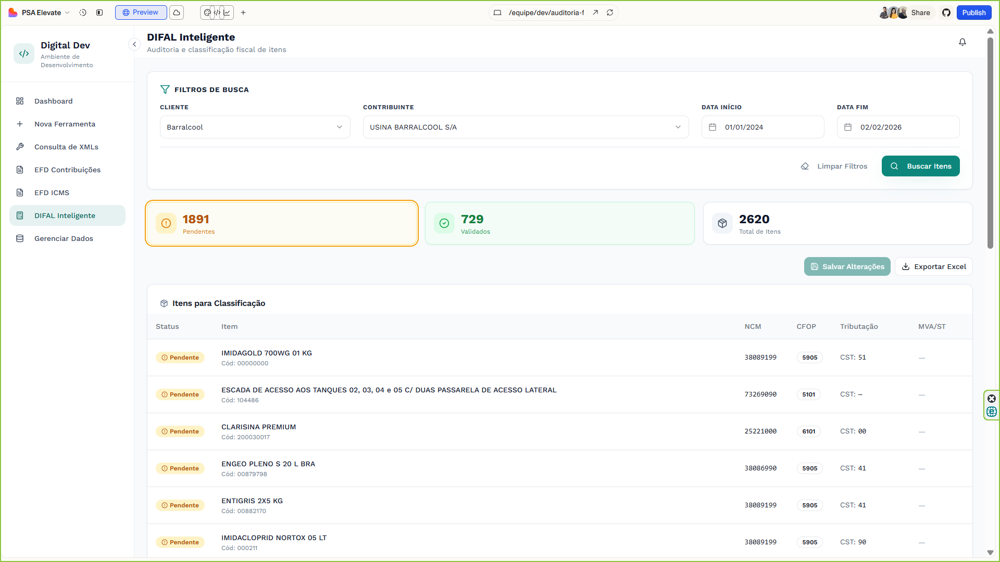
  

  
Visão consolidada do progresso

  

<!-- SEÇÃO 5 -->

  

    5
    <h2 class="editable-text">Sincronização de Dados</h2>
  

  

### 5.1. Alerta de Sincronização Pendente
O sistema trabalha com um cache local para agilidade. Quando existem alterações não enviadas ao servidor, um alerta vermelho é exibido no rodapé ou topo da lista.

  

    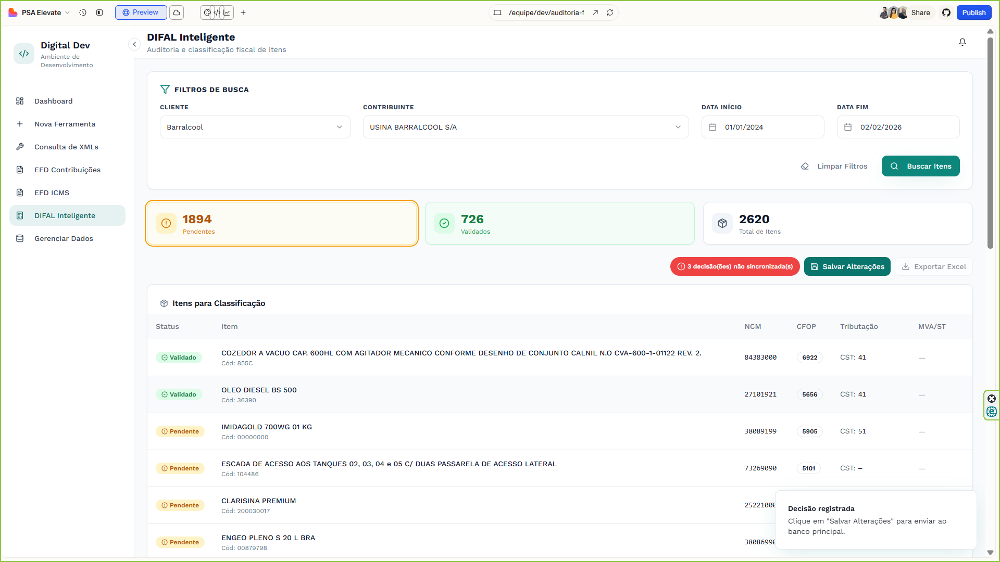
  

  
Indicação de dados pendentes de envio

  warning
  
As alterações não salvas serão perdidas se a página for fechada. Sincronize frequentemente.

### 5.2. Confirmação de Salvamento
Ao clicar em "Salvar Alterações", os dados são transmitidos ao banco de dados. Uma notificação (Toast) confirma o sucesso da operação, garantindo a integridade da auditoria.

  

    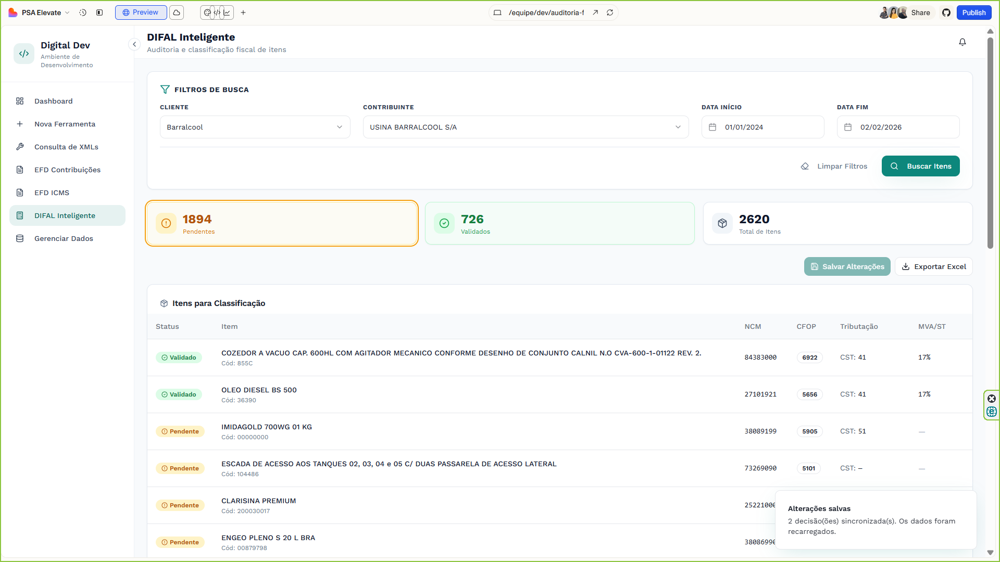
  

  
Conclusão do processo de sincronização

  

<!-- SEÇÃO 6 -->

  

    6
    <h2 class="editable-text">Exportação e Finalização</h2>
  

  

### 6.1. Solicitação de Exportação
Para gerar relatórios externos ou backups da auditoria, o botão "Exportar Excel" inicia o processo de compilação dos dados visíveis na tela.

  

    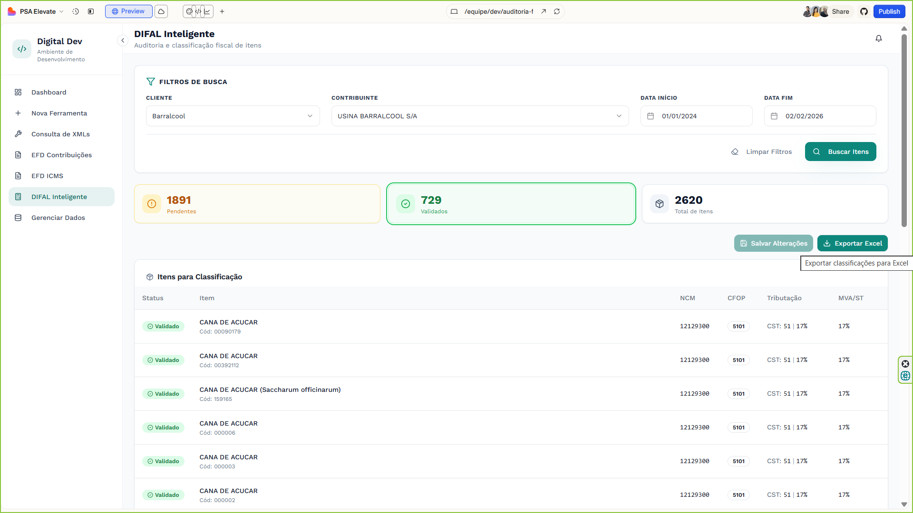
  

  
Início da geração de relatório

### 6.2. Processamento do Arquivo
Durante a geração da planilha, o sistema exibe um indicador de carregamento, informando ao usuário que os dados estão sendo processados no servidor.

  

    
  

  
Aguardando compilação dos dados

### 6.3. Conclusão do Download
Assim que o arquivo é gerado, o download inicia automaticamente pelo navegador e uma notificação de sucesso é exibida na tela.

  

    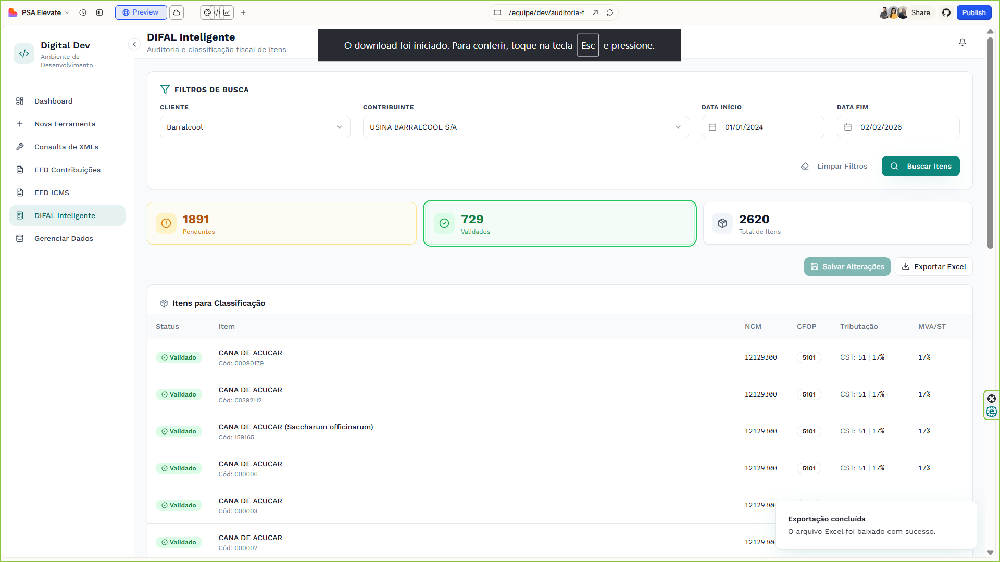
  

  
Confirmação de download realizado

### 6.4. Conferência Final
Antes de encerrar a sessão, é recomendável verificar se a lista final reflete exatamente o trabalho realizado, garantindo que todos os itens críticos foram tratados.

  

    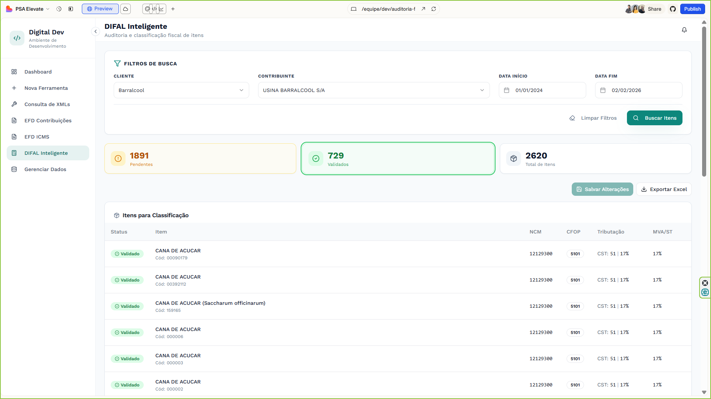
  

  
Revisão final da auditoria

### 6.5. Tela Limpa e Encerramento
O estado ideal para encerramento é uma tela sem alertas de erro, sem pendências de sincronização e com todos os itens devidamente validados.

  

    
  

  
Auditoria finalizada com sucesso

  lightbulb
  
<strong>Dica:</strong> Sempre exporte um backup em Excel antes de encerrar a sessão para garantir a segurança dos dados auditados.

  

